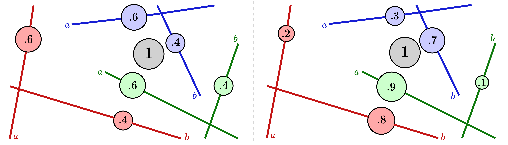

# Distance-Based Tree-Sliced Wasserstein Distance
<div align="center">
    
</div>

[](https://opensource.org/licenses/MIT)
[](https://iclr.cc/Conferences/2025)

Official implementation of the paper "Distance-Based Tree-Sliced Wasserstein Distance" (ICLR 2025).


## Overview

This repository contains the implementation of Distance-Based Tree-Sliced Wasserstein Distance (DB-TSWD), a novel approach for computing optimal transport distances between probability distributions. Our method extends the traditional Tree-Sliced Wasserstein Distance by incorporating distance-based tree construction, leading to more accurate and efficient transport computations.

## Installation
TBF

## Quick Start
TBF

## Main Components
TBF

## Reproducing Paper Results
TBF

## Citation

If you find this code useful in your research, please cite our paper:

```bibtex
@inproceedings{tran2025distance,
    title={Distance-Based Tree-Sliced {W}asserstein Distance},
    author={Tran, Hoang V. and Nguyen-Nhat, Minh-Khoi and Pham, Huyen Trang and Chu, Thanh and Le, Tam and Nguyen, Tan Minh},
    booktitle={International Conference on Learning Representations},
    year={2025},
    url={https://openreview.net/forum?id=OiQttMHwce}
}
```

## License

This project is licensed under the MIT License - see the [LICENSE](LICENSE) file for details.

## Contact

For questions about the code or paper, please open an issue in this repository or contact the authors directly.
